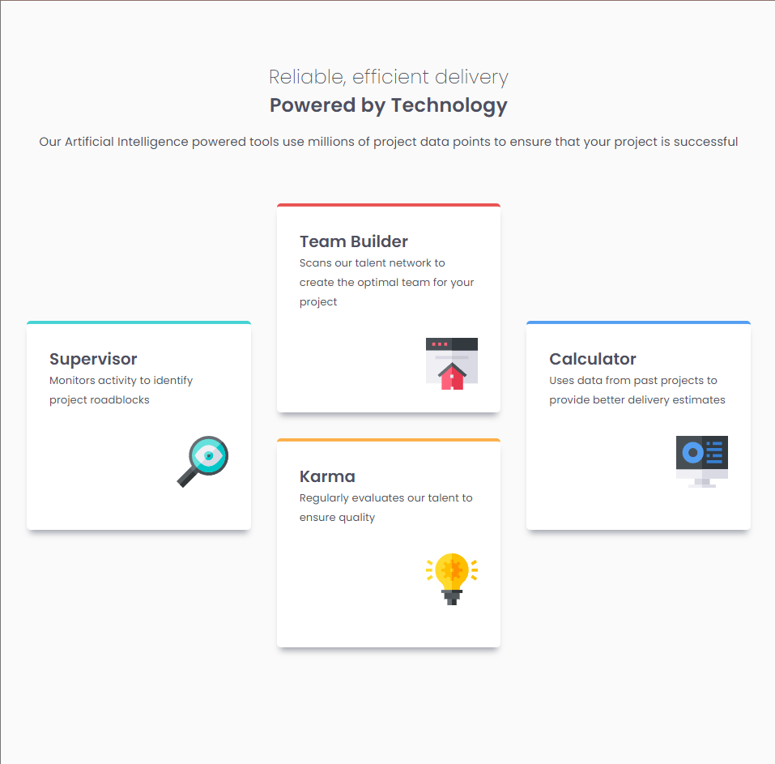
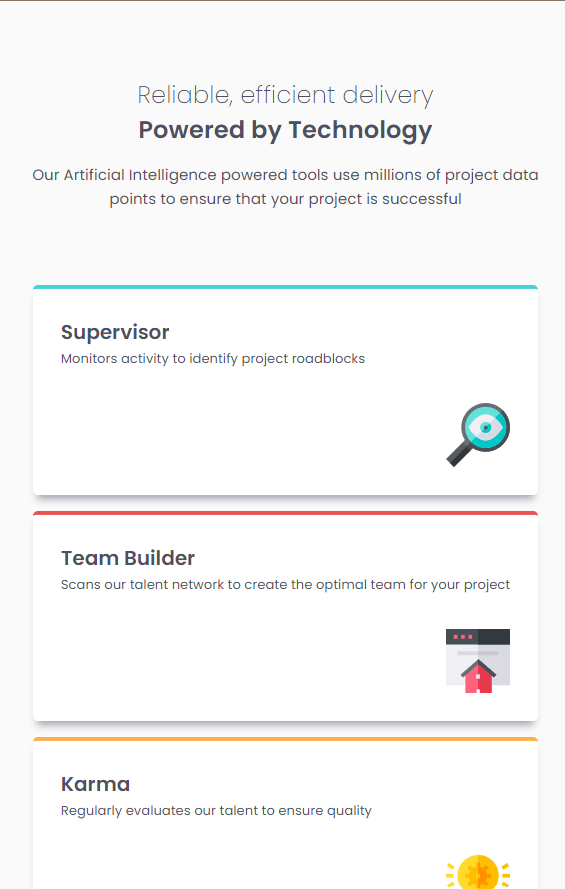

# Frontend Mentor - Four card feature section solution

This is a solution to the [Four card feature section challenge on Frontend Mentor](https://www.frontendmentor.io/challenges/four-card-feature-section-weK1eFYK). 

## Table of contents

- [Overview](#overview)
  - [The challenge](#the-challenge)
  - [Screenshot](#screenshot)
  - [Links](#links)
- [My process](#my-process)
  - [Built with](#built-with)
  - [What I learned](#what-i-learned)
  - [Continued development](#continued-development)
  - [Useful resources](#useful-resources)
- [Author](#author)

## Overview

The task is to create a four card feature selection similar to the one provided in the preview for the challenge from frontendmentor.io

### The challenge

Users should be able to:

- View the optimal layout for the site depending on their device's screen size

### Screenshot





### Links

- Live Site URL: [Add live site URL here](https://veena-k-venugopal.github.io/fm-four-card-feature/)

## My process

I worked on the mobile design first. I used flexbox for the layouts. For desktop design, I used grid. 

### Built with

- Semantic HTML5 markup
- Flexbox
- CSS Grid
- Mobile-first workflow

### What I learned

I was able to add an advanced box shadow using this:
```css
.main-card section {
    box-shadow: 0 8px 8px -4px #a3a5ae;
}
```

### Continued development

I am still not satisfied with the grid layout on desktop design. I would like to keep working on it to create better transitions.   

### Useful resources

- [Surprising Truth About PIxels & Accessibility by Josh Comeau](https://www.joshwcomeau.com/css/surprising-truth-about-pixels-and-accessibility/) - This helped me understand the various measurement representations offered - px, rem, em, etc.
- [Designing Shadows by Josh Comeay](https://www.joshwcomeau.com/css/designing-shadows/) - I found this article helpful in understanding concepts of box-shadow in depth.
- [Using margin-left instead of float](https://forum.freecodecamp.org/t/not-floating-right/409659) - As the title suggests, this helped me work the placement of the icons on the card. 
- [CSS Grid Alignment](https://www.quackit.com/css/grid/tutorial/css_grid_alignment.cfm) - This helped me understand more about various ways to use and implement grids.

## Author

- Frontend Mentor - [Veena-K-Venugopal](https://www.frontendmentor.io/profile/Veena-K-Venugopal)
